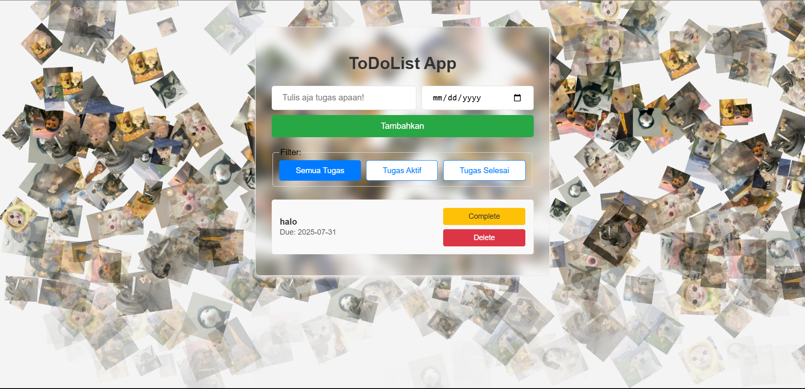

# Aplikasi Web Daftar Tugas Sederhana (To do List)


Aplikasi web yang ringan dan intuitif untuk mengelola tugas harian Anda. Proyek ini mendemonstrasikan konsep-konsep dasar pengembangan web menggunakan HTML, CSS, dan JavaScript, termasuk penanganan formulir, manipulasi DOM, persistensi data (Local Storage), dan pemfilteran dasar.

## Fitur

* **Tambah Tugas Baru:** Tambahkan item tugas baru dengan mudah menggunakan deskripsi tugas dan tanggal jatuh tempo.
* **Tampilkan Daftar Tugas:** Lihat semua tugas Anda dalam daftar yang jelas dan terorganisir.
* **Tandai Selesai:** Ubah status penyelesaian tugas. Tugas yang sudah selesai dibedakan secara visual.
* **Hapus Tugas:** Hapus tugas dari daftar Anda saat tidak lagi diperlukan.
* **Filter Tugas:** Filter tugas Anda untuk menampilkan:
    * Semua tugas
    * Tugas Aktif (belum selesai)
    * Tugas Selesai
* **Validasi Input:** Memastikan bahwa deskripsi tugas dan tanggal jatuh tempo tidak dibiarkan kosong.
* **Persistensi Data:** Tugas disimpan ke Local Storage browser Anda, sehingga tetap ada meskipun Anda menutup dan membuka kembali browser.
* **Desain Responsif:** Aplikasi menyesuaikan tata letaknya untuk tampilan optimal di berbagai ukuran layar (desktop, tablet, seluler).

## Teknologi yang Digunakan

* **HTML**
* **CSS**
* **JavaScript**

## Struktur Proyek

Proyek ini mengikuti struktur direktori yang rapi dan terorganisir:
```
simple-todo-list/
    ├── css/
    │    └── style.css
    ├── js/
    │    └── script.js
    └── index.html
```
## Cara Menjalankan Secara Lokal

Ikuti langkah-langkah sederhana ini untuk membuat aplikasi berjalan di mesin lokal Anda:

1.  **Kloning repositori (Opsional, jika Anda memilikinya di Git):**
    ```bash
    git clone https://github.com/msalmanrafadhlih/ToDo-List-App.git
    ```

2.  **Navigasi ke direktori proyek:**
    ```bash
    cd ToDo-List-App
    ```

3.  **Buka `index.html`:**
    Cukup buka file `index.html` di browser web. kamu  dapat melakukannya dengan mengklik perintah

    ```bash
    ctrl - shit - p 
    ```
    dan carilah "live server: Open with Live Server"

Aplikasi seharusnya sekarang sudah aktif di browser Anda!

## Lisensi

Proyek ini bersifat *open source* dan tersedia di bawah [Lisensi MIT](LICENSE).

---